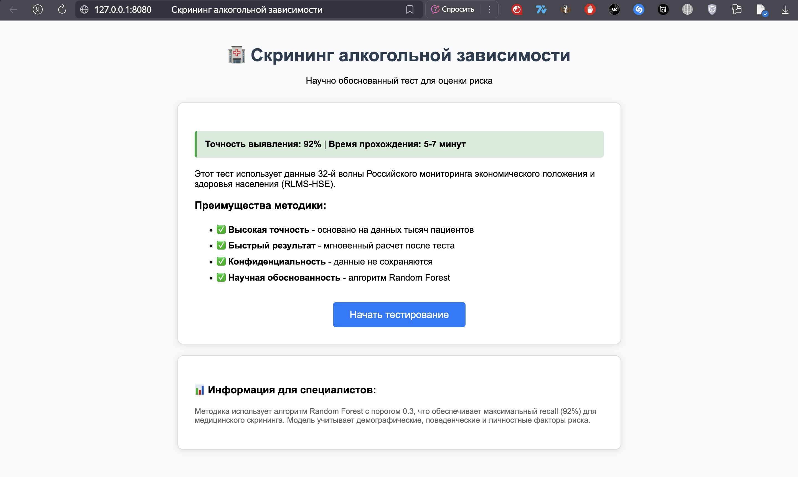
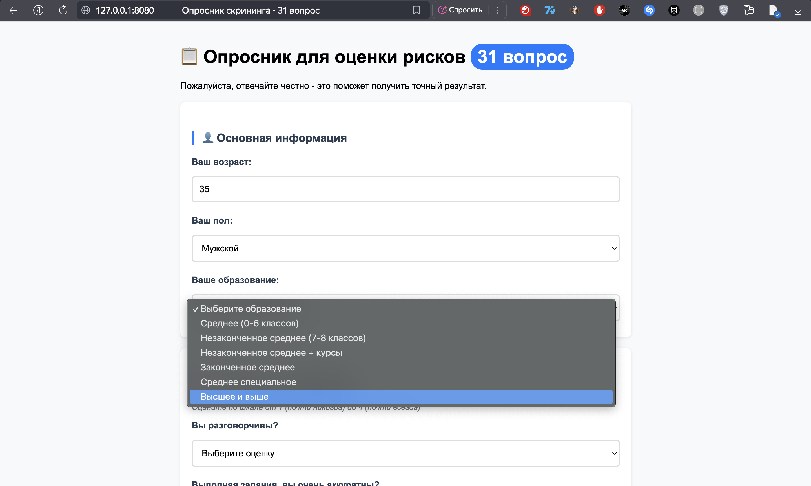
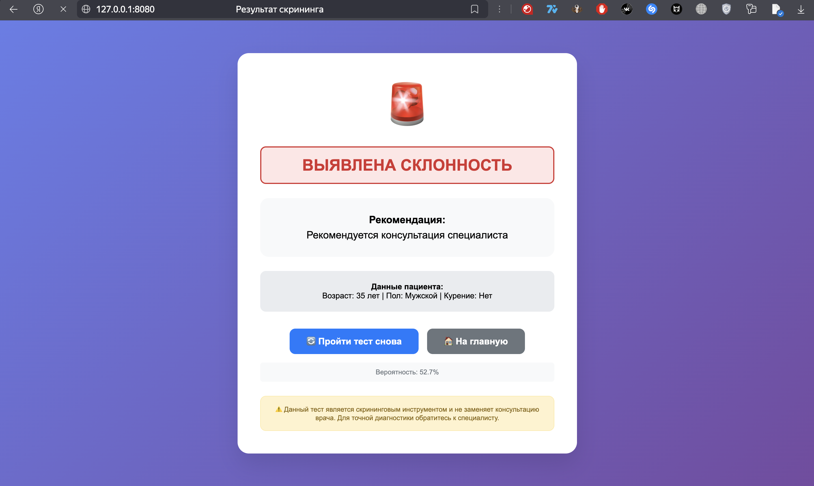

# Alcohol Tendency Prediction Project


Анализ склонности к алкоголю на основе данных RLMS-HSE с применением машинного обучения и статистических методов.

## О проекте

Проект анализирует данные RLMS-HSE (32-я волна) для выявления поведенческой склонности к алкоголю с использованием ML и веб-интерфейса для скрининга. Целевая переменная строится исключительно на поведенческих алкогольных маркерах (частота, обстоятельства употребления), без включения демографических или личностных признаков — это позволяет использовать пол, возраст и личностные черты как независимые предикторы без утечки данных.

## Ключевые результаты

### Статистический анализ
- **Мужчины почти в 2 раза чаще** демонстрируют поведенческую склонность к алкоголю (15.1% vs 7.8%)
- **Статистически значимые различия** (p < 0.0001) подтверждены Z-тестом, хи-квадрат и T-тестом
- **Мужчины имеют в 2.1 раза выше шансы** (Odds Ratio) склонности к алкоголю
- Средний алкогольный индекс выше у мужчин (4.00 vs 3.73, p < 0.0001)

### Машинное обучение

Целевая переменная — бинарный индикатор поведенческого риска, построенный по алкогольным маркерам опросника (употребление на работе, без еды, в барах, на улице и т.д.), с порогом бинаризации по комплексному скору. Класс "высокий риск" составляет ~10.9% выборки (сильный дисбаланс классов), что учтено через `class_weight`/`scale_pos_weight` во всех моделях.

**Сравнение моделей (тестовая выборка):**

| Model    | AUC    | PR-AUC | Accuracy | Precision | Recall | F1-Score |
|----------|--------|--------|----------|-----------|--------|----------|
| XGBoost  | 0.818  | 0.320  | 0.889    | 0.448     | 0.078  | 0.133    |
| XGBoost+ | 0.817  | 0.339  | 0.887    | 0.441     | 0.135  | 0.206    |
| GBoost   | 0.811  | 0.329  | 0.711    | 0.240     | 0.764  | 0.365    |
| Bagging  | 0.809  | 0.326  | 0.631    | 0.209     | 0.858  | 0.336    |

> **Примечание:** ROC-AUC ≈ 0.81 — реалистичный результат для предсказания поведенческого паттерна по личностным чертам, риск-поведению и демографии (без утечки таргета в признаки). Из-за сильного дисбаланса классов (≈89%/11%) для выбора модели дополнительно используется PR-AUC.
>
> **Bagging Classifier** выбран как рабочая модель для скринингового сценария за счёт высокого **Recall** (0.86) — приоритет отдан минимизации пропущенных случаев группы риска, ценой более высокой доли ложных срабатываний (Precision 0.21). Такой trade-off осознанно выбран для задачи предварительного скрининга, а не диагностики.

### Веб-приложение
- **32 вопроса** для комплексной оценки
- **Мгновенные результаты** с интерпретацией
- **Рекомендации** на основе прогноза модели
- Приложение упаковано в **Docker**-контейнер и развёрнуто на **Render**
- **Доступно онлайн:** [click](https://alcohol-tendency-analysis-123.onrender.com/)

### Главная страница


### Страница тестирования


### Результаты


## Инструкция по запуску

### Локально (Python)
```bash
# Клонирование репозитория
git clone https://github.com/bznxb197/alcohol-tendency-analysis.git
cd alcohol-tendency-analysis

# Установка зависимостей
pip install -r requirements.txt

# Запуск веб-приложения
python alcohol_screening_server.py
# Приложение доступно: http://localhost:8080

# Или анализ в Jupyter
jupyter notebook alcohol_analysis.ipynb
```

### Через Docker
```bash
# Сборка образа
docker build -t alcohol-screening .

# Запуск контейнера
docker run -p 8080:8080 alcohol-screening
# Приложение доступно: http://localhost:8080
```

Продакшн-версия приложения развёрнута из того же Docker-образа на платформе **Render**.

## Методология

- **Статистический анализ**: Z-тест для пропорций, хи-квадрат, T-тест, отношение шансов (Odds Ratio)
- **Целевая переменная**: комплексный алкогольный индекс на основе поведенческих маркеров опросника, без демографических/личностных компонент — во избежание утечки данных в признаки
- **ML моделирование**: Random Forest, Gradient Boosting, XGBoost (baseline + GridSearchCV-тюнинг), с коррекцией дисбаланса классов
- **Метрики**: AUC-ROC, PR-AUC, Precision/Recall/F1 — при сильном дисбалансе классов приоритет отдан PR-AUC и Recall в зависимости от сценария использования
- **Веб-интерфейс**: клиент-серверная архитектура для скрининга, упакована в Docker, развёрнута на Render
  
## Структура проекта

```
alcohol-tendency-analysis/
├── alcohol_analysis.ipynb          # Jupyter-ноутбук с исследовательским анализом данных и обучением модели машинного обучения
├── alcohol_screening_server.py     # Основной веб-сервер (Flask/FastAPI) для обработки запросов и предсказаний
├── model.joblib                    # Сериализованная обученная модель (pickle/joblib), загружаемая сервером
├── Dockerfile                      # Инструкция для сборки Docker-образа, упрощающая развёртывание
├── screenshots/                    # Скриншоты интерфейса для демонстрации работы
│   ├── index.png                   # Главная страница
│   ├── test.png                    # Страница прохождения теста/анкеты
│   └── results.png                 # Страница с результатами предсказания
├── templates/                      # HTML-шаблоны для веб-интерфейса
│   ├── index.html                  # Главная страница (описание, кнопка начала тестирования)
│   ├── test.html                   # Страница с вопросами анкеты/теста
│   └── result.html                 # Страница отображения результатов анализа склонности к алкоголю
└── data/                           # Каталог с исходными данными, использованными для обучения и валидации модели
    └── (файл данных)
```


## Данные
**RLMS-HSE** (32-я волна, 11,820 респондентов)

## Ограничения

- Данные кросс-секционные (один срез времени) — модель показывает **ассоциации**, а не причинно-следственные связи между личностными чертами и алкогольным поведением
- Целевая переменная построена на основе эвристических весов алкогольных маркеров, а не валидированной клинической шкалы (например, AUDIT)
- Модель не является диагностическим инструментом и не заменяет консультацию специалиста

---

*Проект предназначен для исследовательских целей и не заменяет медицинскую диагностику.*
